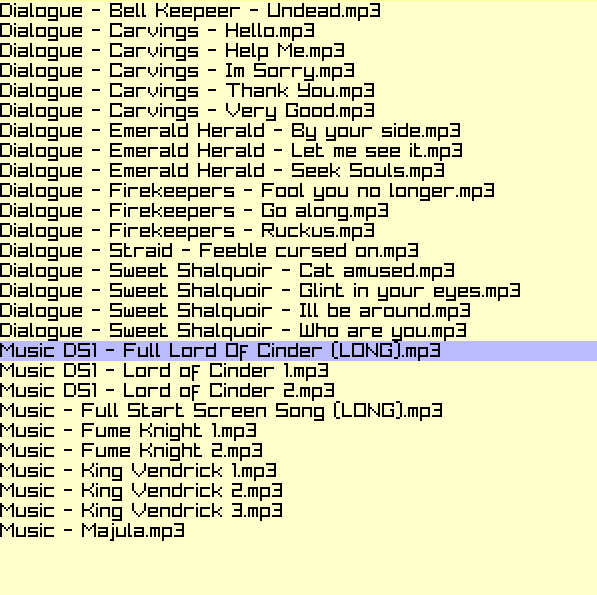
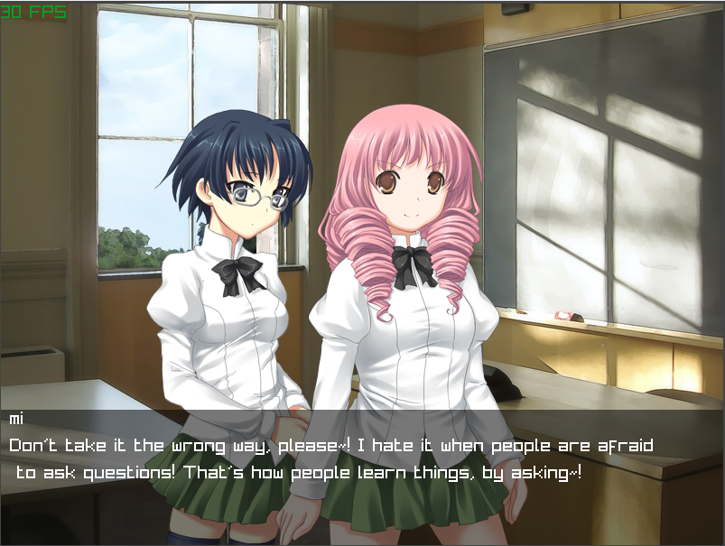

# sporkslip

Small functional interpreter with foreign functions
support (aka shared/dynamic libraries). I made it
before reading about how lisp works and garbage
collectors and without finishing the 'crafting
interpreters' book thus reinventing many wheels
very poorly - but that's what made it fun.

# Compiling

I hidden some files (see .gitignore) like resources,
raylib, libffi - but you can probably fix that and
compile it by running `./build` and following error messages
and run examples by replacing resource files

# Examples

These can be found in tests/ and run with `./run`.
I didn't code any import/include command - instead
I just cat all libs and code into a temp file and run it

## some of the cool ones:

### quine

```
((l (q s p c a) (print a NL q s q q p q s s q p q p q p q c q p q a q c NL))
"\"" "\\" " " ")" "((l (q s p c a) (print a NL q s q q p q s s q p q p q p q c q p q a q c NL))")
```

### 2d sandbox (4builder.s)

*unoptimized but only 90 loc*


### music player (7sfx.s)



### single player pong (8game.s)

*best with persona music as bgm and
vine boom as hit sound*


### Stripped down renpy interpreter that runs Katawa Shoujo (ks.s)

*I had to modify KS script and raylib to make everything work
without me abandoning the whole thing. Sprites, pictures, music
and dialog work but no choices or animations.*



## quirks/bugs
- no error messages - debugging is very hard
- no quotation, can't do list of functions 
and lots of things you'd thing work -
don't. But usually there is a way around it
- slow (mostly because of bad garbage collector)
